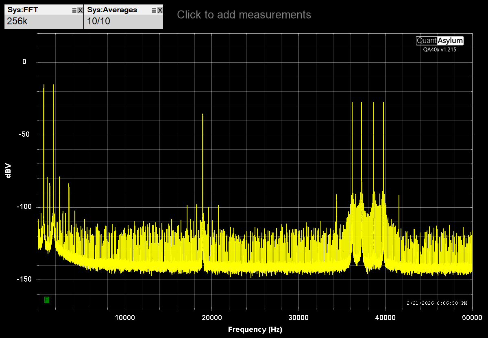
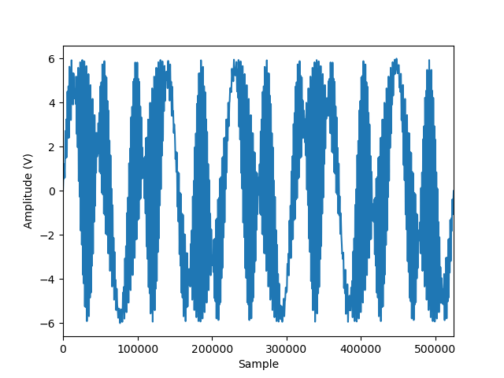

# stereo_mpx
Python code to generate FM stereo multiplex test signals using a Siglent SDG10xx arbitrary waveform generator.

To debug, repair, or align vintage FM stereo receivers, you used to use specialized signal generators such as the Leader LSG-231. This code supports using a modern arbitrary waveform generator instead.

To learn more about how FM stereo works, see [the wikipedia entry](https://en.wikipedia.org/wiki/FM_broadcasting#Stereo_FM). Basically, the audio of left plus right audio is directly modulated onto the carrier, so the signal is backwards compatible with mono/legacy receivers. To allow left & right to be reconstructed in a stereo receiver, an additional left _minus_ right signal is generated and then DSBSC (double sideband suppressed carrier)  modulated onto a 38KHz subcarrier, and then added to the baseband signal before the FM modulation. To facilitate both identification of a stereo signal and reconstruction of an accurate 38KHz subcarrier in low-cost receivers, a pilot tone is also added at 19KHz. The receiver will detect this, and if present, double it to reconstruct a phase synchronous 38KHz subcarrier to allow demodulation of the left minus right signal.

Therefore a stereo multiplex baseband signal consists of three components:
* L + R
* 19KHz pilot (at 10% modulation)
* L - R DSBSC modulated on a 38KHz subcarrier

This code supports creating baseband signals consisting of:
* Distinct or identical pure tones (sine waves) for left and right
* Specify the amplitude of left and right tones independantly
* Specify the amplitude of the 19KHz pilot tone (including supressing it completely)
* Specify the amplitude of the 38KHz subcarrier (including supressing it, and thus the DSBSC signal completely)

The resulting baseband signal has a spectrum of the following form:

In addition, the code supports plotting an oscilloscope-like version of the signal (requires matplotlib to be installed):

The code generates ascii files in one of the formats supported by the Siglent SDG10xx series (and likely other Siglent SDG family members.) These files can be transferred to the SDG using a USB stick, or via the Siglent EasyWaveX application.

This project was inspired by https://github.com/AI5GW/SIGLENT, which sadly I could not get to work.

TODO:
* Enhance docs:
  * Add example command line usage
  * Add info around modulating either IF or broadcast band test signals
  * Add explanation of fundamental freq, as used in the code
  * Add annotation for the spectrum plot, identifying key components
* Code:
  * Add PyVISA support to directly load files into SDG
  * Add pre-emphasis
  * Sanity check audio frequencies
  * Sanity check other frequency dependencies (e.g., multiples of fundamental)
